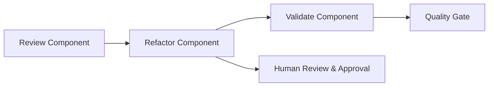
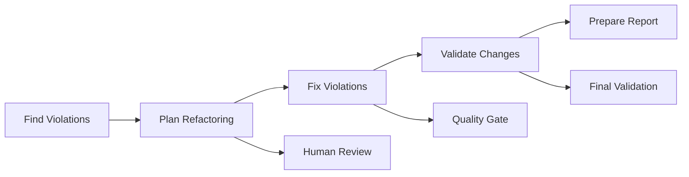

<div align="center">
  
</div>

# Angular MCP Toolkit Documentation

Welcome to the Angular MCP (Model Context Protocol) Toolkit documentation! This toolkit provides tools for Angular development, focusing on design system migration, component refactoring, and code analysis.

## 📚 Documentation Overview

This documentation is organized into several sections to help you get started quickly and understand the toolkit's capabilities:

### 🚀 Getting Started
- **[Getting Started Guide](getting-started.md)** - Quick 5-minute setup guide to install and configure the Angular MCP server

### 🔧 Using the Tools
- **[Tools Reference](tools.md)** - Comprehensive guide to all available AI tools for design system migration and analysis
- **[Component Refactoring Flow](component-refactoring-flow.md)** - 3-step AI-assisted process for improving individual Angular components
- **[Design System Refactoring Flow](ds-refactoring-flow.md)** - 5-step automated workflow for migrating legacy components to design system

### 📋 Advanced Features
- **[Component Contracts](contracts.md)** - System for breaking change detection and refactoring validation
- **[Writing Custom Tools](writing-custom-tools.md)** - Guide for developers to create new MCP tools

### 🏗️ Architecture & Development
- **[Architecture & Internal Design](architecture-internal-design.md)** - Technical details for backend developers and tool authors

## 🎯 Quick Navigation

### For New Users
1. Start with **[Getting Started](getting-started.md)** to set up the toolkit
2. Review **[Tools Reference](tools.md)** to understand available capabilities
3. Try the **[Component Refactoring Flow](component-refactoring-flow.md)** for your first refactoring

### For Design System Migration
1. Use **[Design System Refactoring Flow](ds-refactoring-flow.md)** for systematic legacy component migration
2. Learn about **[Component Contracts](contracts.md)** for validation and safety
3. Reference **[Tools Reference](tools.md)** for specific tool details

### For Developers & Contributors
1. Read **[Architecture & Internal Design](architecture-internal-design.md)** to understand the system
2. Follow **[Writing Custom Tools](writing-custom-tools.md)** to extend functionality
3. Use **[Component Contracts](contracts.md)** for testing and validation

## 🔄 Workflow Integration

The toolkit supports two main workflows:

### Individual Component Improvement

**Guide:** [Component Refactoring Flow](component-refactoring-flow.md)

### Design System Migration

**Guide:** [Design System Refactoring Flow](ds-refactoring-flow.md)

## 🛠️ Key Features

- **AI-Powered Analysis** - Automated code analysis and refactoring suggestions
- **Design System Integration** - Tools specifically designed for Angular design system adoption
- **Contract-Based Validation** - Ensure refactoring safety with before/after comparisons
- **Extensible Architecture** - Add custom tools and analysis capabilities
- **Quality Gates** - Built-in checkpoints for human review and approval

## 📖 Document Relationships

```
Getting Started ──┐
                  ├─→ Tools Reference ──┐
                  │                     ├─→ Component Refactoring Flow
                  │                     └─→ Design System Refactoring Flow
                  │                                      │
                  └─→ Component Contracts ←──────────────┘
                                      │
Writing Custom Tools ←──────────────────┘
                  │
Architecture & Internal Design ←────────┘
```

## 🤝 Contributing

If you're interested in contributing to the toolkit:

1. Read the **[Architecture & Internal Design](architecture-internal-design.md)** for system understanding
2. Follow **[Writing Custom Tools](writing-custom-tools.md)** for adding new functionality
3. Use **[Component Contracts](contracts.md)** for testing your changes

## 📝 Need Help?

- **Setup Issues**: Check [Getting Started](getting-started.md)
- **Tool Usage**: Reference [Tools Reference](tools.md)
- **Workflow Questions**: Review the appropriate flow documentation
- **Technical Details**: Consult [Architecture & Internal Design](architecture-internal-design.md)

---

<div align="center">
  <p><strong>Sponsored by</strong></p>
  
</div>

*This toolkit is designed to work with Cursor IDE, but should also be compatible with other AI-powered development environments like Windsurf or GitHub Copilot.* 