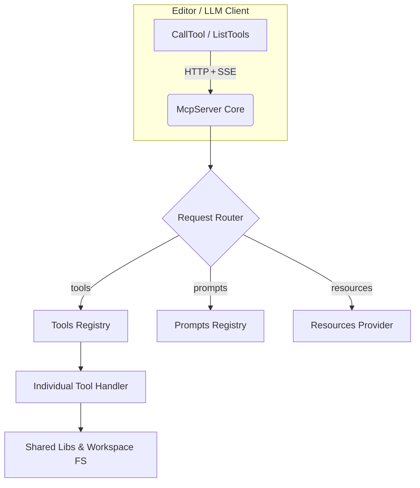

# Angular MCP Server – Architecture & Internal Design

> **Audience:** Backend & tool authors who need to understand how the MCP server is wired together so they can extend it with new tools, prompts, or transports.

---

## 1. High-level Overview

The Angular MCP Server is a **Node.js** process that wraps the generic **[Model Context Protocol SDK](https://github.com/modelcontextprotocol/sdk)** and exposes Angular-specific analysis & refactoring tools.  
It follows a clean, layered design:

1. **Transport & Core (MCP SDK)** – HTTP/SSE transport, request routing, JSON-schema validation.  
2. **Server Wrapper (`AngularMcpServerWrapper`)** – registers prompts, tools, and resources; injects workspace-specific paths.  
3. **Tools Layer (`src/lib/tools/**`)** – thin adapters delegating to shared analysis libraries.  
4. **Shared Libraries (`packages/shared/**`)** – AST utilities, DS coverage, generic helpers.

---

## 2. Runtime Flow



1. The client sends a **`CallTool`** request.  
2. `McpServer` validates the request against JSON Schema.  
3. `AngularMcpServerWrapper` routes it to the correct handler inside **Tools Registry**.  
4. The handler performs analysis (often via shared libs) and returns structured content.  
5. The response streams back.

---

## 3. Bootstrap Sequence

1. **CLI Invocation** (see `.cursor/mcp.json`):
   ```bash
   node packages/angular-mcp/dist/main.js --workspaceRoot=/abs/path ...
   ```
2. `main.ts` → `AngularMcpServerWrapper.create()`
3. **Config Validation** (`AngularMcpServerOptionsSchema`) – checks absolute/relative paths.
4. **File Existence Validation** – ensures Storybook docs & DS mapping files are present.
5. **Server Setup** – registers capabilities & calls:
   - `registerPrompts()`
   - `registerTools()`
   - `registerResources()`
6. Server starts listening.

---

## 4. Directory Layout (server package)

```
packages/angular-mcp-server/
  src/
    lib/
      angular-mcp-server.ts   # Wrapper class (core of the server)
      tools/
        ds/                  # DS-specific tool categories
        shared/              # Internal helpers
      prompts/               # Prompt schemas & impls
      validation/            # Zod schemas & file checks
    index.ts                 # Re-export of wrapper
```

---

## 5. Tools & Extension Points

| Extension | Where to Add | Boilerplate |
|-----------|-------------|-------------|
| **Tool** | `src/lib/tools/**` | 1. Create `my-awesome.tool.ts` exporting `ToolsConfig[]`.  <br>2. Add it to the export list in `tools/ds/tools.ts` (or another category). |
| **Prompt** | `prompts/prompt-registry.ts` | 1. Append schema to `PROMPTS`. <br>2. Provide implementation in `PROMPTS_IMPL`. |
| **Resource Provider** | `registerResources()` | Extend logic to aggregate custom docs or design-system assets. |

All tools share the `ToolsConfig` interface (`@code-pushup/models`) that bundles:
- `schema` (name, description, arguments, return type)
- `handler(request)` async function.

The MCP SDK auto-validates every call against the schema – no manual parsing required.

---

## 6. Configuration Options

| Option | Type | Description |
|--------|------|-------------|
| `workspaceRoot` | absolute path | Root of the Nx/Angular workspace. |
| `ds.storybookDocsRoot` | relative path | Path (from root) to Storybook MDX/Docs for DS components. |
| `ds.deprecatedCssClassesPath` | relative path | JS file mapping components → deprecated CSS classes. |
| `ds.uiRoot` | relative path | Folder containing raw design-system component source. |

Validation is handled via **Zod** in `angular-mcp-server-options.schema.ts`.

---

## 7. Shared Libraries in Play

```
models  (types & schemas)
├─ utils
├─ styles-ast-utils
└─ angular-ast-utils
    └─ ds-component-coverage  (top-level plugin)
```

These libraries provide AST parsing, file operations, and DS analysis. Tools import them directly; they are **framework-agnostic** and can be unit-tested in isolation.

---

## 8. Testing & Examples

`packages/minimal-repo/**` contains miniature Angular apps used by unit/integration tests. They are **not** part of production code but useful when debugging a new tool.

---

## 9. Adding a New Tool – Checklist

1. Identify functionality and pick/create an appropriate shared library function.  
2. Generate a JSON-schema with arguments & result shape (can use Zod helper).  
3. Implement handler logic (avoid heavy FS operations in main thread; prefer async).  
4. Export via `ToolsConfig[]` and append to category list.  
5. Write unit tests.
6. Update `docs/tools.md` once published.

---